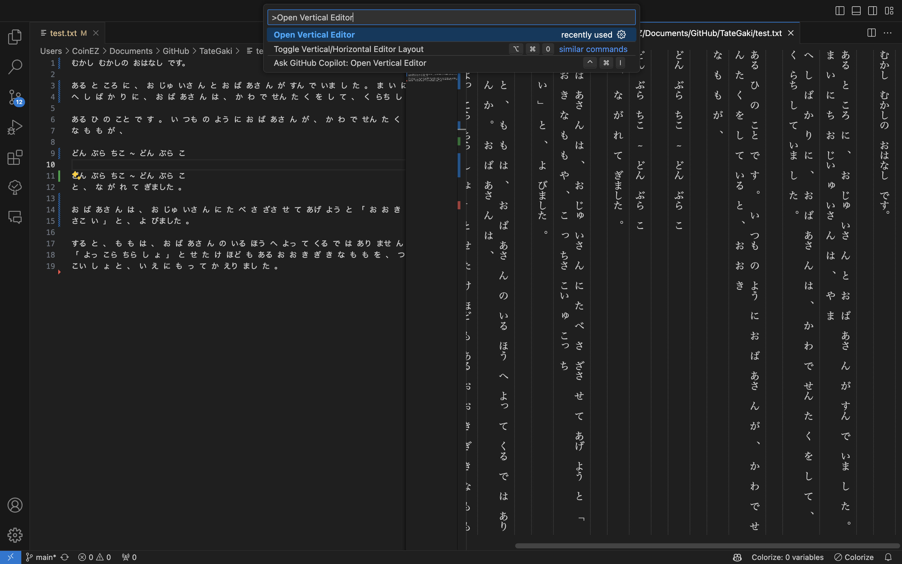

# TateGaki - Vertical Writing Extension for VSCode

TateGaki (縦書き) is a VSCode extension that enables vertical writing, primarily designed for Japanese text in .txt files.

## Features

- Opens the currently active .txt file in an embedded vertical text editor (top to bottom, right to left)
- Syncs with the original .txt file on save
- Automatically saves content when closing the vertical editor
- Works exclusively with .txt files

## Usage

1. Open a `.txt` file in VSCode.
2. Use the command palette (F1 or `Ctrl+Shift+P`) and search for "Open Vertical Editor".
3. Edit your text in the vertical editor.
4. Use Cmd+S (Mac) or Ctrl+S (Windows/Linux) to save changes.
5. Close the vertical editor when done - changes will be automatically saved.

## Requirements

- Visual Studio Code version **1.91.0** or higher

## Known Issues

- Currently only supports `.txt` files.
- May not handle complex text layouts or mixed scripts optimally.

# TateGaki - VSCode用縦書きエクステンション

TateGaki（縦書き）は、VSCode内で縦書きを可能にしてくれる拡張機能です。

## 概要

- 現在開いている.txtファイルを、埋め込み型の縦書き用エディタで開きます
- 保存時に元の.txtファイルと同期されます
- 縦書き用エディタを閉じる際にも自動的に保存されます
- .txtファイルのみが対象です

## 使い方

1. VSCodeで`.txt`ファイルを開く
2. コマンドパレット（F1または`Ctrl+Shift+P`）を使用し、「Open Vertical Editor」を検索
3. 縦書き用エディタが開くのを確認
4. 保存には、Cmd+S（Mac）またはCtrl+S（Windows/Linux）を使用
5. 編集が完了したら縦書き用エディタを閉じる - 自動保存

## 要件

- Visual Studio Code バージョン**1.91.0**以上

## Release Notes

### 0.0.3

- Vertical line separators
- Japanese README
- Video instruction of README

### 0.0.2

- Added automatic save functionality when closing the vertical editor
- Improved sync between vertical editor and original file (BUG FIX)

### 0.0.1

- Initial release of TateGaki
  - Basic vertical text transformation
  - Sync with original .txt file
  - .txt file restriction

## License

This extension is licensed under the MIT License.

